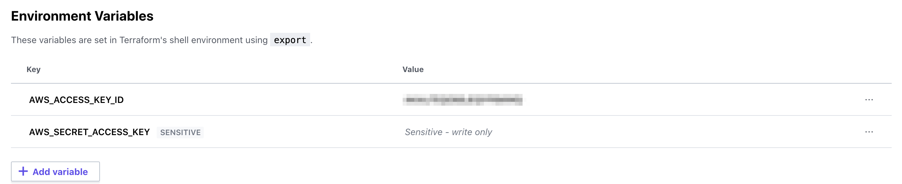

#The Very Bare Bones setup required to run Terraform Cloud 
This is a no frills repository with absolutely the bare minimum syntax that is needed to create a dynamodb table on AWS using terraform cloud. 

The file ProviderConfig.tf contains the providers that you need to connect to AWS while BareBonesProject.tf contains the resource that you need to create. 

This assumes, you have added your AWS credentials as environment variables in your settings. 

AWS_ACCESS_KEY_ID 

AWS_SECRET_ACCESS_KEY 

